# team4

This is a web app used to help users find teammates for their personal projects. The app will target primarily university students. University students can access the premade course teams created by the Admin, create their profiles, and search for their ideal teammates based on their profiles.

# Phase 1

### Data:

all data is hardcoded in the js files.

### Sidebars:

Most pages have the same sidebar to keep a consistent layout. Since we are not dealing with the data transforming right now, all sidebars are hardcoded but will be dynamically changed depending on data in phase 2.

## Views:

### Login view, path:`/`

Login username and password:
For normal user: `user`/`user`
For Admin user: `admin`/`admin`

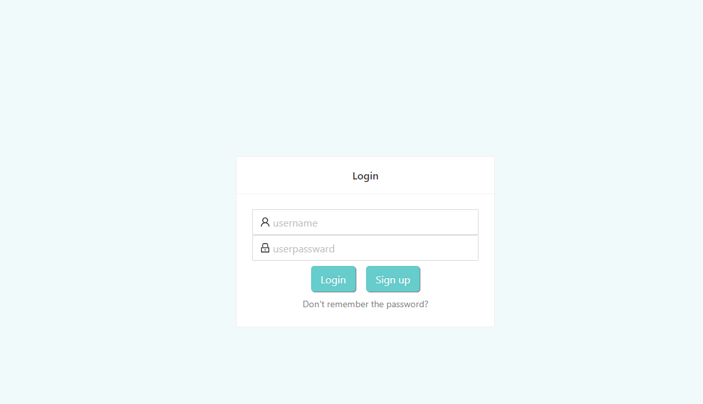

- All usernames are unique.
- All normal users can find their passwords by the `Don't remember the password` button (Admin cannot).
- Users can sign up by entering the username, password, and then click the `sign up` button

### Home View (User) path: `/Home`

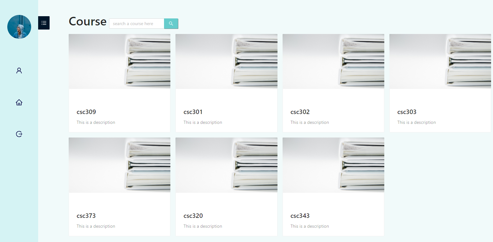

- User can search for a particular course by using the search bar. The search result will be dynamically updated when use types.
- There are three buttons on the sidebar
  - First one goes to the profile page of this user
  - Second one goes to the home page which is this page
  - Third one Log this user out, and goes to login page
- Click on any course go to the Team page where you can find a team and join them.

## Teams View (User) path: `/Course`

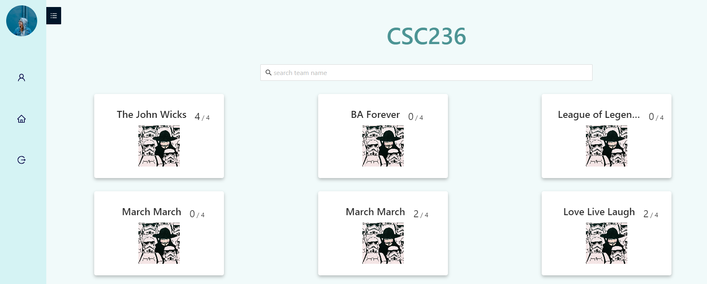

- Those are the teams in course csc236
- Each card represent a team, and their team logo and title are displayed on the card
- Click the title of the card to see the detail of this team.
- A user can create a Team

### Single Team View (TeamLeader) path `/Team`

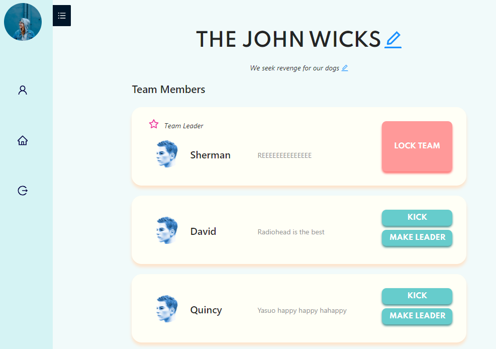

- Team Leader can lock the team, so that other user cannot join this team.
- Team Leader can kick any team member by clicking kick button.
- Team Leader cannot leave the team until he makes another member the new leader, or this team has no other team member.
- Team Leader can change the title and description of the team.

### (Team member view) same path

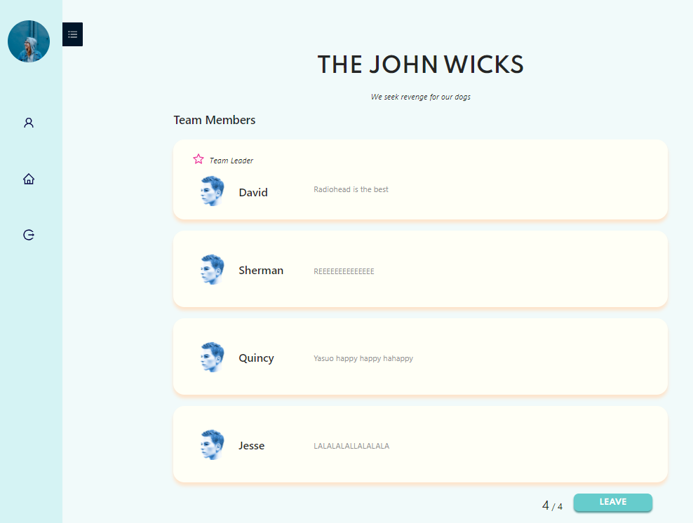

- Team member can leave the team by clicking leave button.

### (Team member view) same path

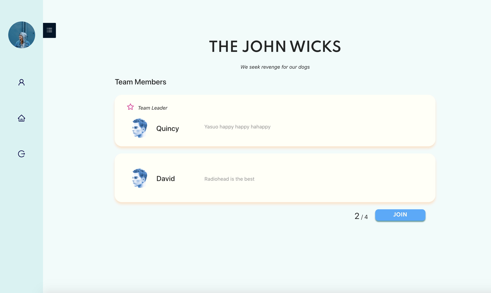

- Users not part of the team can join the team (if capacity allows) by clicking join button.

### Profile path: `/Profile`

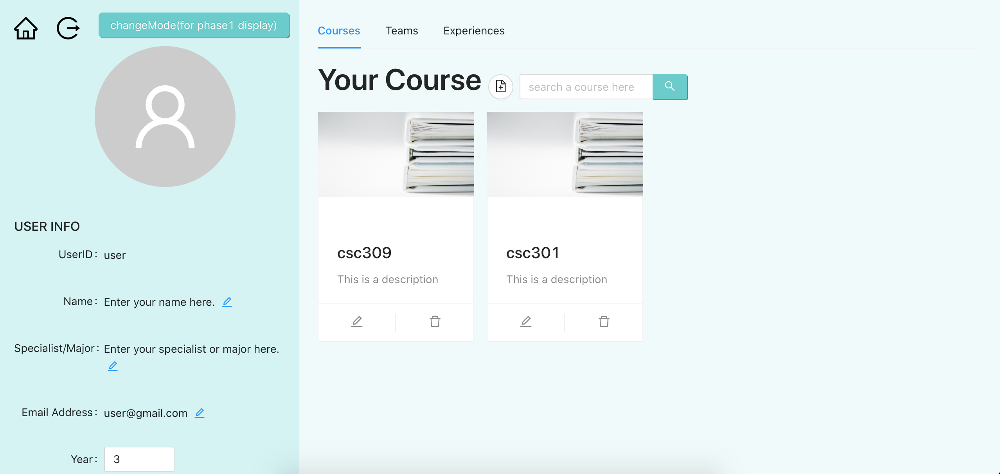

## Admin Pages

> note that all data on the sidebar is hardcoded right now

### Admin (Home page) path: `/Admin`

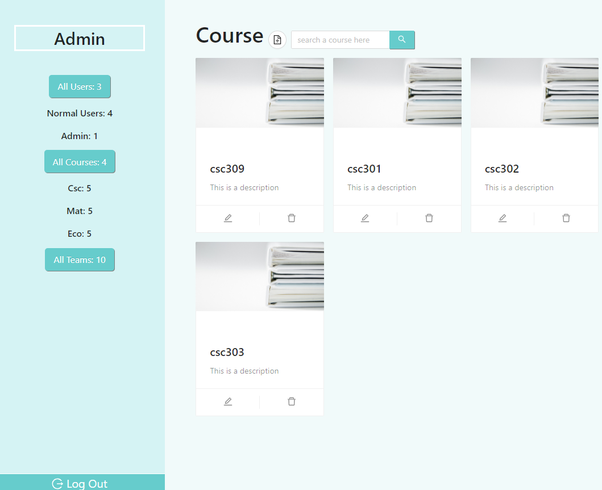

- There are three buttons in the sidebar
  - Click first one will go to `/AdminUsers` page to show all users in the database
  - Click Second one will go to `/Admin` page to show all Courses that are open for teaming
  - The Third Button is unclickable, just a way to highlight
    - display the total number of teams in our database
  - All numbers will be dynamically changed when we have real data
- Admin can add new Course by clicking the small add button next to the title "Course"
- Admin can log out by clicking the Log out button at the bottom
- Each course card is editable
  - 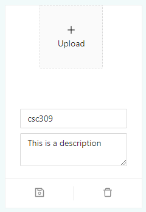
  - we can change the image of this course, title of this course, and description of this course.
  - Click the card will go to `\CourseAdmin` to see all the teams in this Course

### All teams of one Course, path: `/CourseAdmin `

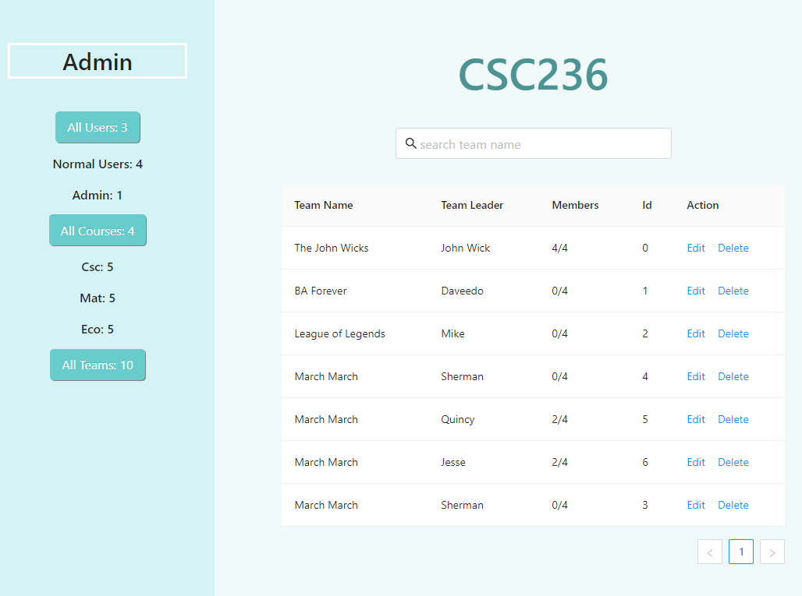

- sider bar is the same as the Admin page one, but the third button will display all the teams in this particular course
- Admin can search a team by team name
- Admin can delete a team by clicking delete button
- Admin can edit a team by clicking Edit. This goes to the `teamAdmin` Page

### Admin Team page path: `/teamAdmin`

- This page is very similar to Team page of the Team Leader except that we can kick team leader also.
- Before you kick the team leader, you have to pick a new team leader first.

### Admin Users page path: `AdminUsers`

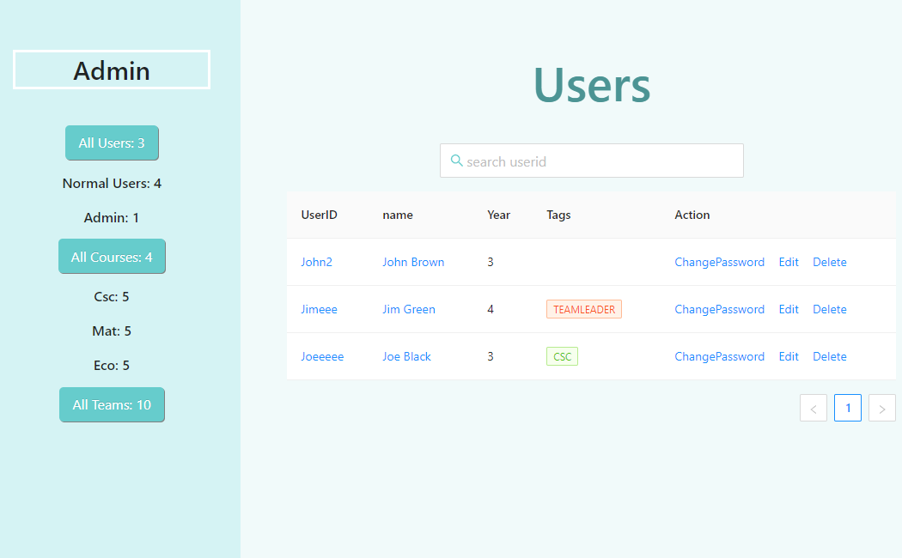

- this page display all the users in our database
- admin can edit User's profile by clicking `edit`, and this will go to their profile page
- admin can delete a user from the database by clicking `delete`
- admin can change the user's password by clicking `ChangePassword `Button

## Third-party libraries used:

Ant Design
